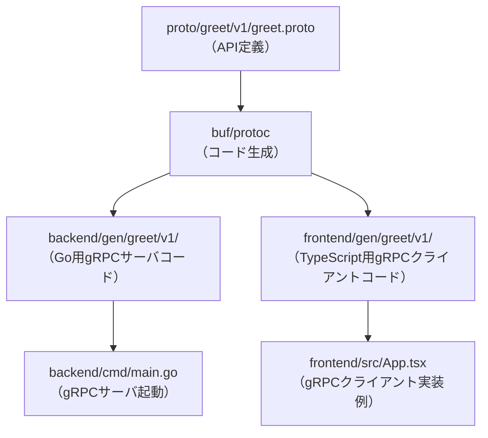

# System Patterns

## 主要設計パターン・技術的意思決定
- **APIファースト開発**: protoでAPI定義→自動生成→各層で利用
- **gRPC+Connectプロトコル**: HTTP/2ベースの高速通信、型安全なAPI
- **分離開発**: バックエンド・フロントエンドを独立して開発・デプロイ可能
- **Docker Composeによる一括起動**: サービス間連携の容易化
- **サンプルサービス**: greetサービス（gen/greet/v1/配下）

## システムアーキテクチャ概要
- **バックエンド**: Go（connect-go）によるgRPCサーバ
- **フロントエンド**: React（TypeScript, connect-web）によるgRPCクライアント
- **APIスキーマ管理**: Protocol Buffers（protoディレクトリ）
- **コード生成**: buf, protoc, connect-go, connect-web
- **開発環境統合**: Docker, Docker Compose
- **フロントエンド開発**: Vite, ESLint, TypeScript

## ディレクトリ構成

```
go-grpc-connect/
├── backend/         # Go製gRPCサーバの実装・生成コード
│   ├── cmd/         # サーバ起動用main.go
│   ├── gen/         # protoから生成されたGoコード
│   ├── go.mod       # Goモジュール管理ファイル
│   └── go.sum
├── frontend/        # React(TypeScript)製gRPCクライアント
│   ├── gen/         # protoから生成されたTypeScriptコード
│   ├── public/      # 静的ファイル
│   ├── src/         # フロントエンドアプリ本体
│   ├── package.json # フロントエンド依存管理
│   └── ...          # 各種設定ファイル
├── proto/           # APIスキーマ（Protocol Buffers定義）
│   ├── greet/       # サービスごとのprotoファイル
│   ├── buf.yaml     # buf設定ファイル
│   └── buf.gen.yaml # bufコード生成設定
├── docker-compose.yml # サービス一括起動用
├── Dockerfile         # サーバ用Dockerビルド定義
├── package.json       # プロジェクト全体の依存管理（必要に応じて）
└── README.md          # プロジェクト概要
```

## コンポーネント関係図（Mermaid）



## その他
- ESLint, TypeScript, Viteによるフロントエンド品質担保
- Dockerfile, docker-compose.ymlで開発・本番環境の統一
